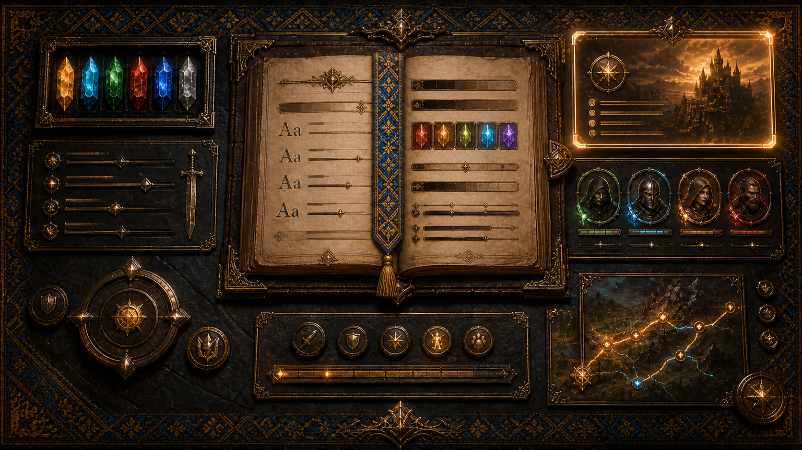
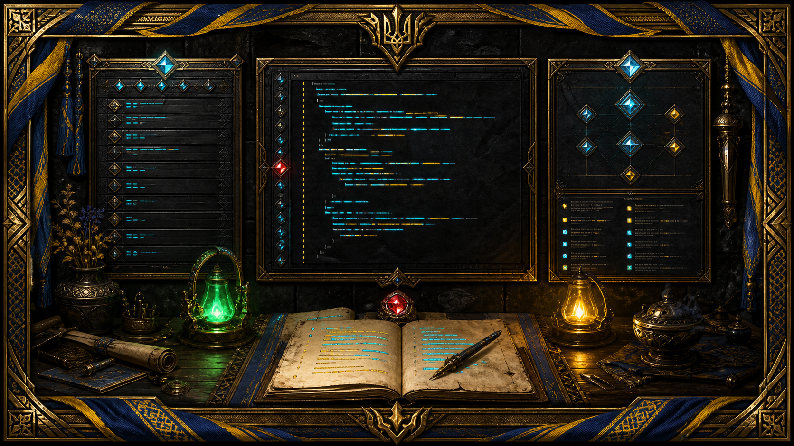

# ClassicUO — Bad Newbie & Yoko Injection

<p align="center">
  
</p>

<p align="center">
  Розширений клієнт Ultima Online на основі ClassicUO з налаштуваннями Bad Newbie,<br>
  Yoko Injection Runtime, вбудованою Yoko IDE, AutoLoad, макросами та повним API Manual.
</p>

<p align="center">
  <a href="https://github.com/LIHACHTETAN/ClassicUO-BadNewbie-YokoInjection/wiki">Wiki</a> ·
  <a href="https://github.com/LIHACHTETAN/ClassicUO-BadNewbie-YokoInjection/wiki/UA-Installation">Встановлення</a> ·
  <a href="https://github.com/LIHACHTETAN/ClassicUO-BadNewbie-YokoInjection/wiki/UA-Bad-Newbie">Bad Newbie</a> ·
  <a href="https://github.com/LIHACHTETAN/ClassicUO-BadNewbie-YokoInjection/wiki/UA-Yoko">Yoko Runtime та IDE</a> ·
  <a href="https://github.com/LIHACHTETAN/ClassicUO-BadNewbie-YokoInjection/wiki/Runtime-API-Manual">Runtime API</a>
</p>

## Про клієнт

**ClassicUO — Bad Newbie & Yoko Injection** — це розширений ігровий клієнт Ultima Online. Він зберігає звичну роботу ClassicUO та доповнює її глибоким налаштуванням інтерфейсу, додатковими інформаційними панелями, індикаторами ігрових подій і повним середовищем автоматизації Yoko.

Ця сторінка описує клієнт у цілому: його призначення, основні компоненти, налаштування, автоматизацію, документацію та порядок першого запуску.

Клієнт призначений для користувачів, яким потрібні:

- сучасний і швидкий клієнт Ultima Online на основі ClassicUO;
- точне налаштування шрифтів, кольорів і відображення інформації;
- hover-картки, Info Bar та окремі індикатори касту;
- керування AutoLoot, AutoBuy, AutoSell і параметрами руху;
- виконання кількох Yoko-скриптів;
- запуск, пауза, зупинка та покрокове налагодження скриптів;
- AutoLoad і прив’язка Yoko-процедур до клавіш;
- API Manual, побудований за реально зареєстрованими командами Runtime.

## Основні компоненти

| Компонент | Що він робить |
| --- | --- |
| **ClassicUO** | Підключення до сервера, вхід персонажем, відображення світу, предметів, мобілів, gump-вікон, журналу, звуку та ігрового інтерфейсу. |
| **Bad Newbie** | Налаштування шрифтів і кольорів, hover-карток, Info Bar, каст-індикаторів, руху та допоміжних ігрових функцій. |
| **Yoko Injection Runtime** | Виконання Yoko BASIC-скриптів і доступ до клієнта через зареєстрований простір команд `UO.*`. |
| **Yoko IDE** | Редактор, Outline, Problems, Output, Debug Console, API Inspector, Variables, Watch, Call Stack і покрокове налагодження. |
| **AutoLoad і макроси** | Автоматичне завантаження вибраного файла та запуск Yoko-процедур або повних прикладів з клавіатури. |
| **API Manual** | Сигнатури, параметри, return/effect, допустимі значення, пов’язані елементи та приклади реального Yoko-синтаксису. |

## ClassicUO та ігровий інтерфейс

<p align="center">
  
</p>

Клієнт використовує файли даних Ultima Online, які користувач отримує законним способом. Ігрові дані до репозиторію не входять. Адреса сервера, порт, шлях до даних і параметри входу налаштовуються у звичайному процесі запуску ClassicUO.

Налаштування зберігаються у профілі. Параметри, які залежать від персонажа, можуть зберігатися окремо для кожного персонажа.

## Bad Newbie

<p align="center">
  
</p>

Розділ **Options → Bad Newbie** розширює стандартні налаштування клієнта:

- незалежні шрифт, розмір і колір для інтерфейсу, журналу, чату, overhead-тексту, імен, шкоди, tooltip, hover-карток і підписів касту;
- завантаження власних `.ttf` та `.otf` із папки `Fonts`;
- збереження початкового динамічного UO hue при ввімкненому **Use original game/source color**;
- hover-картки для персонажів, предметів, backpack, вкладених контейнерів, екіпірування й тайлів;
- Info Bar і додаткові відображувані параметри;
- окремі індикатори касту для свого персонажа, інших гравців і NPC/монстрів;
- налаштування довжини, положення, шрифту й кольору індикатора;
- дальність видимості, лінія території та обхід перешкод;
- AutoLoot, AutoBuy та AutoSell.

Hover-картки показують лише ті дані, які реально доступні клієнтові: назву, serial, graphic/body/tile ID, hue, кількість, координати, container, layer і отримані властивості. Клієнт не вигадує приховані серверні значення.

[Повний опис Bad Newbie](https://github.com/LIHACHTETAN/ClassicUO-BadNewbie-YokoInjection/wiki/UA-Bad-Newbie)

## Yoko Injection Runtime

Yoko Runtime виконує скрипти на Yoko BASIC і надає доступ до клієнта через API `UO.*`. Точкою входу виконуваного файла є `SUB Main()`:

```vb
SUB Main()
    UO.Print('Yoko запущено')
END SUB
```

Після відкриття або зміни файла індексується весь документ: процедури й функції доступні без необхідності прокручувати редактор до кінця. Кілька скриптів можуть працювати паралельно й мають незалежні стани.

У довгих циклах необхідно використовувати `UO.Wait(...)`, щоб виконання не блокувало ігровий інтерфейс:

```vb
SUB Main()
    WHILE UO.GetDead() = 0
        ' дії скрипта
        UO.Wait(100)
    WEND
END SUB
```

[Yoko Runtime та швидкий старт](https://github.com/LIHACHTETAN/ClassicUO-BadNewbie-YokoInjection/wiki/UA-Yoko)

## Yoko IDE

<p align="center">
  
</p>

Yoko IDE використовує Eclipse Theia та Monaco Editor. У ній доступні Explorer, редактор, Outline, Problems, Output, Debug Console, API Inspector, Variables, Watch, Call Stack та API Manual.

Основні дії:

| Дія | Клавіша |
| --- | --- |
| Запустити вибраний скрипт | `F5` |
| Запустити без налагодження | `Ctrl+F5` |
| Почати налагодження | `F4` |
| Перевірити синтаксис | `F6` |
| Пауза або продовження | `F7` |
| Continue | `F8` |
| Додати або прибрати breakpoint | `F9` |
| Step Over | `F10` |
| Step Into | `F11` |
| Step Out | `Shift+F11` |
| Зупинити | `Shift+F5` |
| Перезапустити налагодження | `Ctrl+Shift+F5` |
| Відкрити документацію символу | `Ctrl+F1` |

Поточний рядок виконання підсвічується. Зелений індикатор означає, що скрипт працює, жовтий — що його поставлено на паузу, а звичайний або чорний індикатор позначає вибраний зупинений скрипт.

[Повний опис Yoko IDE](https://github.com/LIHACHTETAN/ClassicUO-BadNewbie-YokoInjection/wiki/Yoko-IDE)

## AutoLoad і макроси

<p align="center">
  
</p>

Структура каталогу скриптів:

```text
Autoload\
├── <файли AutoLoad з довільними назвами>
└── Scripts\
    └── <звичайні Yoko-скрипти>
```

- активний AutoLoad вибирається у **Options → Yoko Injection**;
- вибір зберігається окремо для кожного персонажа;
- під час входу запускається `SUB Main()` вибраного AutoLoad;
- **Yoko Auto Load** у макросах показує процедури вибраного AutoLoad й дозволяє призначити їх на клавіші;
- **Yoko Example** зберігає повний скрипт `SUB Main() ... END SUB` у звичайному профілі макросів;
- новий безіменний файл IDE зберігається в `Autoload\Scripts`, а відкритий файл — у своє початкове розташування.

[AutoLoad і макроси](https://github.com/LIHACHTETAN/ClassicUO-BadNewbie-YokoInjection/wiki/UA-AutoLoad)

## Runtime API Manual

<p align="center">
  
</p>

Єдиним джерелом істини для API Manual є фактична реєстрація Yoko Runtime:

```text
Runtime registration → API Manual
```

Для кожного зареєстрованого елемента Manual показує точне ім’я, тип, реальні сигнатури, параметри, обов’язковість, значення за замовчуванням, return/effect, допустимі значення, пов’язані елементи та приклади Yoko Script. Користувацькі `SUB` і `FUNCTION` зі скриптів не змішуються з Runtime API та відображаються в Outline.

- [Повний Runtime API](https://github.com/LIHACHTETAN/ClassicUO-BadNewbie-YokoInjection/wiki/Runtime-API-Manual)
- [API за алфавітом](https://github.com/LIHACHTETAN/ClassicUO-BadNewbie-YokoInjection/wiki/Runtime-API-Alphabetical-Index)
- [Аудит Runtime API](https://github.com/LIHACHTETAN/ClassicUO-BadNewbie-YokoInjection/wiki/Runtime-API-Audit)

## Age of Power у Wiki

Документація Age of Power винесена в окремий розділ Wiki. Там зібрано опис світу, консольні команди, квести й NPC, крафт, предмети, ресурси, навички, інструменти та способи отримання матеріалів.

- [Огляд Age of Power](https://github.com/LIHACHTETAN/ClassicUO-BadNewbie-YokoInjection/wiki/UA-Age-of-Power)
- [Консольні команди](https://github.com/LIHACHTETAN/ClassicUO-BadNewbie-YokoInjection/wiki/UA-Age-of-Power-Console-Commands)
- [Квести та NPC](https://github.com/LIHACHTETAN/ClassicUO-BadNewbie-YokoInjection/wiki/UA-Age-of-Power-Quests)
- [Крафт](https://github.com/LIHACHTETAN/ClassicUO-BadNewbie-YokoInjection/wiki/UA-Age-of-Power-Crafting)
- [Каталог предметів](https://github.com/LIHACHTETAN/ClassicUO-BadNewbie-YokoInjection/wiki/UA-Item-Guide-Age-of-Power)
- [Ресурси](https://github.com/LIHACHTETAN/ClassicUO-BadNewbie-YokoInjection/wiki/UA-Age-of-Power-Resources)

## Мови документації

Wiki доступна українською, російською, англійською, французькою, німецькою, італійською, іспанською, китайською, японською та корейською мовами.

[Вибрати мову Wiki](https://github.com/LIHACHTETAN/ClassicUO-BadNewbie-YokoInjection/wiki/Languages)

## Встановлення

1. Завантажте клієнт із розділу GitHub Releases.
2. Розпакуйте його в окрему папку з правом запису.
3. Запустіть `ClassicUO.exe`.
4. Вкажіть каталог законно отриманих файлів Ultima Online.
5. Налаштуйте адресу та порт потрібного сервера.
6. Увійдіть до облікового запису й виберіть персонажа.
7. Налаштуйте Bad Newbie та Yoko Injection відповідно до своїх потреб.

[Докладна інструкція зі встановлення](https://github.com/LIHACHTETAN/ClassicUO-BadNewbie-YokoInjection/wiki/UA-Installation)

## Розробка та перевірка

У Wiki описано архітектуру клієнта, складання з вихідного коду, перевірку Runtime API, тестування інтерфейсу й підготовку випуску.

- [Архітектура](https://github.com/LIHACHTETAN/ClassicUO-BadNewbie-YokoInjection/wiki/Project-Architecture)
- [Складання з вихідного коду](https://github.com/LIHACHTETAN/ClassicUO-BadNewbie-YokoInjection/wiki/Build-from-Source)
- [Тестування та перевірка](https://github.com/LIHACHTETAN/ClassicUO-BadNewbie-YokoInjection/wiki/Testing-and-Verification)
- [Усунення проблем](https://github.com/LIHACHTETAN/ClassicUO-BadNewbie-YokoInjection/wiki/UA-Troubleshooting)

## Важливо

- Ігрові дані Ultima Online не входять до репозиторію.
- Клієнт не є ігровим сервером і не замінює серверну частину.
- Клієнт бачить лише ті дані, які сервер надсилає йому.
- Автоматизацію слід використовувати відповідно до правил конкретного сервера.
- Не публікуйте логіни, паролі, особисті профілі, журнали та інші приватні дані.
- Проєкт не є офіційним продуктом Electronic Arts, Broadsword, Ultima Online або команди ClassicUO.

## Ліцензії

Основний код ClassicUO поширюється за умовами **BSD 2-Clause License**. Eclipse Theia та інші сторонні компоненти мають власні ліцензії, повідомлення про які необхідно зберігати під час розповсюдження.
